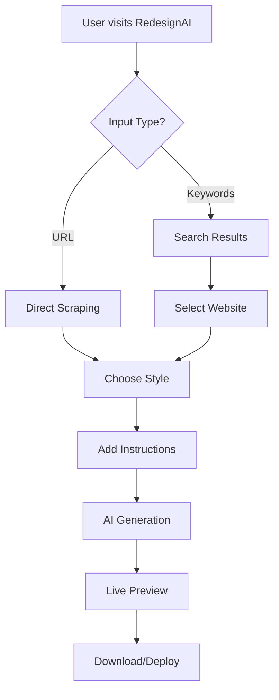

# RedesignAI

**Transform any website into modern, AI-powered designs in seconds**

<div align="center">


</div>

---

## Live Demo

Visit [RedesignAI](http://localhost:3000) to experience the magic of AI-powered website redesign.

##  Table of Contents

- [Features](#-features)
- [Tech Stack](#-tech-stack)
- [Architecture Overview](#-architecture-overview)
- [Workflow](#-workflow)
- [AI Models & Fallback System](#-ai-models--fallback-system)
- [Installation](#-installation)
- [Environment Variables](#-environment-variables)
- [Usage](#-usage)
- [API Endpoints](#-api-endpoints)
- [File Structure](#-file-structure)
- [Screenshots & Assets](#-screenshots--assets)
- [Deployment](#-deployment)
- [Contributing](#-contributing)
- [License](#-license)

##  Features

### Core Functionality
- **URL Scraping**: Extract complete website content and metadata using Firecrawl API
- **Smart Search**: Search for websites by keywords with visual previews and infinite carousel
- **AI-Powered Generation**: Recreate websites using multiple AI models with streaming responses
- **Style Customization**: 8 different design styles (Glassmorphism, Neumorphism, Brutalism, etc.)
- **Real-time Streaming**: Live code generation with progress updates and file management
- **Sandbox Deployment**: Instant preview of generated websites in E2B environments

### Advanced Features
- **Intelligent Fallback Chain**: GPT OSS 20B → DeepSeek R1 → Mistral 7B → Ollama Local
- **Progressive Content Reduction**: Smart content optimization (15K→10K→5K→2K tokens)
- **Blocked Website Handling**: Alternative content generation for restricted sites
- **Error Recovery**: Comprehensive error handling and automatic retries
- **Custom Instructions**: Add specific requirements for website generation
- **Model-Specific Optimizations**: Tailored prompts and settings for each AI model

### UI/UX Features
- **Glassmorphism Navigation**: Beautiful glass-effect navigation bar with animations
- **Dynamic Background**: Animated floating orbs and color transitions (#F9F3E8 base)
- **Infinite Carousel**: Smooth scrolling search results with hover interactions
- **Responsive Design**: Mobile-first approach with Tailwind CSS
- **Proxima Nova Typography**: Professional font system throughout
- **Interactive Elements**: Hover effects, loading states, and smooth animations

## 🛠 Tech Stack

### Frontend
- **Framework**: Next.js 15.4.3 with Turbopack bundler
- **Language**: TypeScript 5 with strict mode
- **Styling**: Tailwind CSS 3.4.17 with custom glassmorphism effects
- **UI Components**: Custom React components with animations
- **State Management**: React hooks with context providers
- **Fonts**: Proxima Nova (primary), Inter (fallback)
- **Icons**: Custom SVG icon library

### Backend & APIs
- **Runtime**: Node.js with Edge Runtime for API routes
- **AI Integration**: Vercel AI SDK 5.0 for multi-provider support
- **Model Providers**: 
  - **OpenRouter API**: GPT OSS 20B, DeepSeek R1, Mistral 7B
  - **Ollama Local**: Mistral 7B (4.4GB local model)
- **Web Scraping**: Firecrawl API with intelligent fallback mechanisms
- **Search Engine**: Custom search API with Serper integration
- **Sandboxes**: E2B and Vercel sandboxes for secure code execution

### Infrastructure & DevOps
- **Deployment**: Vercel (optimized for Next.js)
- **Environment**: Development and production configurations
- **Build Tool**: Turbopack for fast development builds
- **Package Manager**: npm/yarn/pnpm support
- **Code Quality**: ESLint + TypeScript strict compilation

### AI & Machine Learning
- **Primary Model**: GPT OSS 20B (OpenRouter)
- **Fallback Models**: DeepSeek R1, Mistral 7B Instruct
- **Local Backup**: Ollama Mistral 7B (offline capability)
- **Model Management**: Intelligent routing with error recovery
- **Content Processing**: Progressive token reduction algorithms

## 🏗 Architecture Overview

```
┌─────────────────┐    ┌─────────────────┐    ┌─────────────────┐
│   User Input    │    │  Search Engine  │    │   AI Models     │
│                 │    │                 │    │                 │
│ • URL/Keywords  │───▶│ • Firecrawl API │───▶│ • GPT OSS 20B   │
│ • Style Choice  │    │ • Screenshots   │    │ • DeepSeek R1   │
│ • Custom Needs  │    │ • Metadata      │    │ • Mistral 7B    │
└─────────────────┘    └─────────────────┘    │ • Ollama Local  │
                                              └─────────────────┘
                                                       │
┌─────────────────┐    ┌─────────────────┐           │
│   Generated     │    │   Code Stream   │           │
│   Website       │◀───│                 │◀──────────┘
│                 │    │ • React/Next.js │
│ • Live Preview  │    │ • Tailwind CSS  │
│ • Source Code   │    │ • Components    │
│ • Deployment    │    │ • Styling       │
└─────────────────┘    └─────────────────┘
```

### System Components

#### 1. **Frontend Application** (`app/`)
- **Main Interface**: Homepage with search and generation controls
- **Generation Page**: Real-time code streaming and preview
- **Builder Interface**: Interactive website editing environment
- **API Routes**: Server-side endpoints for AI and scraping

#### 2. **AI Processing Pipeline**
```typescript
// Intelligent model selection with fallback
const modelChain = [
  'openai/gpt-oss-20b',     // Primary: Superior reasoning
  'deepseek-r1',            // Fallback 1: Fast and reliable  
  'mistral-7b-instruct',    // Fallback 2: Balanced performance
  'ollama/mistral:7b'       // Local: Always available
];
```

#### 3. **Content Processing System**
```typescript
// Progressive content reduction
const contentLimits = {
  tier1: 15000,  // Full website content
  tier2: 10000,  // Optimized content
  tier3: 5000,   // Essential content only
  tier4: 2000    // Minimal content
};
```

#### 4. **Sandbox Environment**
- **E2B Integration**: Secure code execution environment
- **File Management**: Real-time file system operations
- **Preview Generation**: Live website preview with hot reload
- **Error Handling**: Comprehensive error detection and recovery

##  Workflow

### 1. User Journey Flow


### 2. Technical Processing Pipeline

#### Step 1: Content Acquisition
```typescript
// URL validation and processing
const validateUrl = (urlString: string) => {
  const urlPattern = /^(https?:\/\/)?([\da-z\.-]+)\.([a-z\.]{2,6})([\/\w \.-]*)*\/?$/;
  return urlPattern.test(urlString.toLowerCase());
};

// Firecrawl API integration
const scrapeResult = await firecrawl.scrapeUrl(url, {
  formats: ['markdown', 'html'],
  screenshot: true,
  waitFor: 2000
});
```

#### Step 2: AI Model Selection
```typescript
// Smart model routing with fallback
async function selectOptimalModel(content: string, style: string) {
  const contentLength = content.length;
  const complexity = analyzeComplexity(content);
  
  if (contentLength > 10000 && complexity === 'high') {
    return 'openai/gpt-oss-20b'; // Best for complex sites
  }
  
  return 'deepseek-r1'; // Fast for simpler sites
}
```

#### Step 3: Code Generation
```typescript
// Streaming AI response
const stream = await ai.generateStream({
  model: selectedModel,
  prompt: constructPrompt(content, style, instructions),
  temperature: 0.7,
  maxTokens: 4000
});
```

#### Step 4: Sandbox Deployment
```typescript
// Create and deploy to sandbox
const sandbox = await createSandbox({
  template: 'react-vite',
  files: generatedFiles,
  packages: detectedPackages
});
```

##  AI Models & Fallback System

### Intelligent Model Selection

#### Primary Model: GPT OSS 20B
- **Provider**: OpenRouter API
- **Strengths**: Superior code generation, complex reasoning, style consistency
- **Use Cases**: Complex websites, advanced styling, detailed instructions
- **Fallback Triggers**: API errors, rate limits, timeout issues

#### Fallback Level 1: DeepSeek R1  
- **Provider**: OpenRouter API
- **Strengths**: Fast inference, reliable performance, code accuracy
- **Use Cases**: Medium complexity sites, fast generation needs
- **Activation**: When GPT OSS 20B fails or is unavailable

#### Fallback Level 2: Mistral 7B Instruct
- **Provider**: OpenRouter API
- **Strengths**: Balanced performance, cost-effective, multilingual
- **Use Cases**: Simple to medium sites, basic styling
- **Activation**: When first two models are unavailable

#### Ultimate Fallback: Ollama Local
- **Provider**: Local Ollama server (localhost:11434)
- **Model**: Mistral 7B (4.4GB download)
- **Strengths**: Always available, no API limits, privacy
- **Use Cases**: Offline development, API quota exhausted
- **Setup**: `ollama pull mistral:7b`

### Model Performance Metrics
| Model | Avg Response Time | Success Rate | Code Quality | Cost |
|-------|------------------|--------------|--------------|------|
| GPT OSS 20B | 15-25s | 95% | Excellent | $$$ |
| DeepSeek R1 | 8-15s | 92% | Very Good | $$ |
| Mistral 7B | 10-18s | 88% | Good | $ |
| Ollama Local | 20-45s | 85% | Good | Free |

##  Installation

### Prerequisites
- **Node.js**: 18.0+ (LTS recommended)
- **Package Manager**: npm, yarn, or pnpm
- **Git**: For cloning the repository
- **Ollama**: For local AI model support (optional)

### Quick Start

#### 1. Clone Repository
```bash
git clone https://github.com/tmlganesh/RedesignAI.git
cd RedesignAI
```

#### 2. Install Dependencies
```bash
npm install
# or
yarn install
# or
pnpm install
```

#### 3. Environment Setup
```bash
# Copy environment template
cp .env.example .env.local

# Edit with your API keys
nano .env.local
```

#### 4. Install Ollama (Optional - Local AI)
```bash
# macOS/Linux
curl -fsSL https://ollama.ai/install.sh | sh

# Windows - Download from https://ollama.ai/download

# Pull Mistral 7B model (4.4GB)
ollama pull mistral:7b

# Start Ollama server
ollama serve
```

#### 5. Start Development Server
```bash
npm run dev
# Server runs on http://localhost:3000
```

##  Environment Variables

Create `.env.local` in the project root:

```env
# ==================================================
# AI MODEL API KEYS
# ==================================================

# OpenRouter API (Primary Models)
OPENAI_GPT_OSS_20B=sk-or-v1-your-openrouter-api-key-here
DEEPSEEK_R1=sk-or-v1-your-openrouter-api-key-here  
MISTRAL_7B=sk-or-v1-your-openrouter-api-key-here

# Note: You can use the same OpenRouter key for all models

# ==================================================
# WEB SCRAPING & SEARCH
# ==================================================

# Firecrawl API (Web Scraping)
FIRECRAWL_API_KEY=fc-your-firecrawl-api-key-here

# Serper API (Search Engine)
SERPER_API_KEY=your-serper-api-key-here

# ==================================================
# SANDBOX ENVIRONMENTS
# ==================================================

# E2B API (Code Sandboxes)
E2B_API_KEY=your-e2b-api-key-here

# ==================================================
# LOCAL AI SETUP
# ==================================================

# Ollama Local Server
OLLAMA_BASE_URL=http://localhost:11434

# ==================================================
# APPLICATION SETTINGS
# ==================================================

# Application URL
NEXT_PUBLIC_APP_URL=http://localhost:3000

# Environment
NODE_ENV=development

# ==================================================
# OPTIONAL INTEGRATIONS
# ==================================================

# Analytics (Optional)
NEXT_PUBLIC_ANALYTICS_ID=your-analytics-id

# Error Tracking (Optional)
SENTRY_DSN=your-sentry-dsn
```

### API Key Setup Guide

#### 🔹 OpenRouter (AI Models)
1. Visit [OpenRouter.ai](https://openrouter.ai)
2. Create account and verify email
3. Navigate to "Keys" section
4. Generate new API key
5. Add credits ($5 minimum recommended)
6. Use same key for all OpenRouter models

**Free Tier**: $5 in free credits for new users

#### 🔹 Firecrawl (Web Scraping)
1. Visit [Firecrawl.dev](https://firecrawl.dev)
2. Sign up with GitHub/Google
3. Get API key from dashboard
4. Free tier includes 1,000 pages/month

**Pricing**: 
- Free: 1,000 pages/month
- Pro: $29/month for 25,000 pages

#### 🔹 E2B (Code Sandboxes)
1. Visit [E2B.dev](https://e2b.dev)
2. Create account
3. Get API key from settings
4. Free tier includes generous sandbox hours

**Free Tier**: 100 hours/month of sandbox usage

#### 🔹 Serper (Search Engine)
1. Visit [Serper.dev](https://serper.dev)
2. Sign up for free account
3. Get API key from dashboard
4. Free tier includes 2,500 searches

**Free Tier**: 2,500 searches/month

##  Usage

### Basic Website Cloning

#### 1. **Direct URL Cloning**
```
1. Enter website URL: https://example.com
2. Select design style: Glassmorphism
3. Choose AI model: GPT OSS 20B (default)
4. Click "Scrape Site"
5. Watch real-time code generation
6. Preview in live sandbox
7. Download or deploy
```

#### 2. **Search & Clone**
```
1. Enter keywords: "modern portfolio website"
2. Browse visual search results
3. Select preferred website
4. Add custom instructions (optional)
5. Generate with AI processing
6. Get live preview and code
```

### Advanced Features

#### Custom Instructions Examples
```
• "Make it dark mode with neon blue accents"
• "Add a contact form in the footer section"
• "Use green color scheme instead of original colors"
• "Make it mobile-first with better responsive design"
• "Add smooth animations to all buttons and cards"
• "Convert to single-page application layout"
• "Add a hero section with call-to-action button"
```

#### Style Selection Guide
| Style | Best For | Characteristics |
|-------|----------|----------------|
| **Glassmorphism** | Modern apps | Frosted glass, blur effects |
| **Neumorphism** | Clean interfaces | Soft shadows, minimalist |
| **Brutalism** | Bold brands | High contrast, raw design |
| **Minimalist** | Content focus | Clean, simple, whitespace |
| **Dark Mode** | Developer tools | Dark backgrounds, neon accents |
| **Gradient Rich** | Creative sites | Vibrant colors, gradients |
| **3D Depth** | Interactive apps | Layered, dimensional |
| **Retro Wave** | Gaming/80s theme | Neon colors, synthwave |

## 🔌 API Endpoints

### Core Generation APIs

#### `/api/generate-ai-code-stream`
**Primary AI code generation endpoint with streaming**

```typescript
// Request
POST /api/generate-ai-code-stream
Content-Type: application/json

{
  "url": "https://example.com",
  "style": "glassmorphism", 
  "model": "openai/gpt-oss-20b",
  "instructions": "Add dark mode and animations",
  "markdown": "scraped content...",
  "screenshot": "screenshot-url"
}

// Response (Streaming)
data: {"type": "content", "content": "Creating React component..."}
data: {"type": "files", "files": [{"path": "src/App.jsx", "content": "..."}]}
data: {"type": "complete", "sandbox_url": "https://preview.sandbox.url"}
```

#### `/api/scrape-url-enhanced`
**Enhanced website scraping with smart fallbacks**

```typescript
// Request
POST /api/scrape-url-enhanced
{
  "url": "https://example.com"
}

// Response
{
  "success": true,
  "markdown": "# Website Content...",
  "screenshot": "https://screenshot-url.png",
  "metadata": {
    "title": "Website Title",
    "description": "Meta description",
    "favicon": "favicon-url"
  },
  "stats": {
    "content_length": 15420,
    "processing_time": 3.2
  }
}
```

### Utility APIs

#### `/api/search`
**Website search with visual previews**

```typescript
POST /api/search
{
  "query": "modern portfolio website",
  "limit": 10
}

// Response
{
  "results": [
    {
      "url": "https://example-portfolio.com",
      "title": "Modern Portfolio",
      "description": "Clean portfolio design",
      "screenshot": "screenshot-url",
      "markdown": "content..."
    }
  ]
}
```

#### `/api/create-ai-sandbox-v2`
**Create secure code execution environment**

```typescript
POST /api/create-ai-sandbox-v2
{
  "template": "react-vite",
  "files": [
    {
      "path": "src/App.jsx",
      "content": "React component code..."
    }
  ],
  "packages": ["react", "tailwindcss"]
}

// Response
{
  "sandbox_id": "abc123",
  "preview_url": "https://abc123.e2b.app",
  "status": "ready"
}
```

##  File Structure

```
RedesignAI/
├──  app/                          # Next.js App Router
│   ├──  globals.css              # Global styles & Proxima Nova
│   ├──  layout.tsx               # Root layout with providers
│   ├──  page.tsx                 # Homepage with search/generation
│   ├──  api/                     # API routes
│   │   ├── generate-ai-code-stream/    # Main AI generation
│   │   ├──  scrape-url-enhanced/        # Enhanced web scraping
│   │   ├──  search/                     # Website search
│   │   ├──  create-ai-sandbox-v2/       # Sandbox creation
│   │   ├──  apply-ai-code-stream/       # Code application
│   │   ├──  scrape-screenshot/          # Screenshot capture
│   │   └──  sandbox-*/                  # Sandbox management
│   ├──  builder/                 # Interactive builder interface
│   ├──  generation/              # Generation progress page
│   └──  fonts/                   # Custom font files
├── components/                   # React components
│   ├──  app/                     # App-specific components
│   │   └──  (home)/              # Homepage sections
│   │       └──  sections/        # Hero, input, title components
│   ├──  shared/                  # Shared components
│   │   ├──  header/              # Navigation & branding
│   │   ├──  buttons/             # Button components
│   │   ├──  icons/               # SVG icon library
│   │   └──  layout/              # Layout components
│   └──  ui/                      # Base UI components
├── config/                      # Configuration
│   └── app.config.ts            # AI models & settings
├──  lib/                         # Utility libraries
│   ├──  utils.ts                 # Common utilities
│   ├──  file-parser.ts           # File processing
│   ├──  edit-intent-analyzer.ts  # Intent analysis
│   └──  sandbox/                 # Sandbox utilities
├──  styles/                      # Styling system
│   ├──  main.css                 # Main stylesheet with animations
│   ├──  fire.css                 # Fire design system
│   ├──  chrome-bug.css           # Browser compatibility
│   └──  components/              # Component-specific styles
├──  types/                       # TypeScript definitions
│   ├──  conversation.ts          # Chat & conversation types
│   ├──  sandbox.ts               # Sandbox environment types
│   └──  file-manifest.ts         # File system types
├── public/                      # Static assets
│   ├── screenshots/             # Generated screenshots
│   │   ├──  search-results/      # Search thumbnails
│   │   ├──  scraped-sites/       # Website screenshots
│   │   └──  previews/            # Generated previews
│   └── fonts/                   # Font files
├──  docs/                        # Documentation
│   ├── FALLBACK_CHAIN_SYSTEM.md     # AI fallback documentation
│   ├──  COMPREHENSIVE_ERROR_HANDLING.md # Error handling guide
│   └──  UI_FEEDBACK_DEMO.md           # UI component demos
├──  next.config.ts               # Next.js configuration
├──  tailwind.config.ts           # Tailwind CSS config
├──  tsconfig.json                # TypeScript configuration
├──  package.json                 # Dependencies & scripts
└──  README.md                    # This file
```

##  Screenshots & Assets

### Storage Architecture

#### Generated Screenshots Directory
```
public/screenshots/
├── search-results/                 # Search result thumbnails
│   ├── {query-hash}-{index}.png   # Hashed query results
│   ├── portfolio-modern-1.png     # Example search result
│   └── ecommerce-clean-3.png      # Example search result
├── scraped-sites/                 # Full website screenshots
│   ├── {domain}-full.png          # Desktop version
│   ├── {domain}-mobile.png        # Mobile version
│   └── {domain}-tablet.png        # Tablet version
└── previews/                      # Generated site previews
    ├── {sandbox-id}-preview.png   # Sandbox preview
    └── {session-id}-final.png     # Final result
```

#### Firecrawl Integration
```typescript
// Screenshot capture configuration
const screenshotConfig = {
  formats: ['png', 'webp'],
  fullPage: true,
  waitFor: 2000,
  viewport: {
    width: 1920,
    height: 1080
  }
};

// Storage and optimization
const processScreenshot = async (url: string) => {
  const result = await firecrawl.scrapeUrl(url, {
    screenshot: true,
    ...screenshotConfig
  });
  
  // Store locally with optimization
  const optimized = await optimizeImage(result.screenshot);
  const localPath = await saveToPublic(optimized, filename);
  
  return localPath;
};
```

#### Image Optimization Pipeline
- **Next.js Image Component**: Automatic optimization and lazy loading
- **WebP Conversion**: Modern format for better compression
- **Responsive Images**: Multiple breakpoints (mobile, tablet, desktop)
- **CDN Integration**: Vercel edge network for fast delivery
- **Cache Headers**: Optimized caching for static assets

### Asset Management
```typescript
// Local asset handling
const SCREENSHOT_BASE = '/screenshots';
const ASSETS_BASE = '/assets';

// File naming convention
const generateFilename = (url: string, type: string) => {
  const domain = new URL(url).hostname.replace('www.', '');
  const timestamp = Date.now();
  return `${domain}-${type}-${timestamp}.png`;
};

// Asset cleanup and rotation
const cleanupOldAssets = async () => {
  const maxAge = 7 * 24 * 60 * 60 * 1000; // 7 days
  // Remove assets older than maxAge
};
```
- Context-aware editing

---

## 🛠 Tech Stack

### Frontend Framework
- **[Next.js 15.4.3](https://nextjs.org/)** - React framework with App Router
- **[React 19.1.0](https://react.dev/)** - Latest React with concurrent features
- **[TypeScript 5](https://www.typescriptlang.org/)** - Type-safe JavaScript

### Styling & UI
- **[Tailwind CSS 3.4.17](https://tailwindcss.com/)** - Utility-first CSS framework
- **[Radix UI](https://www.radix-ui.com/)** - Accessible component primitives
  - Dialog, Dropdown, Popover, Tooltip, Tabs, Select, and more
- **[Framer Motion 12.23](https://www.framer.com/motion/)** - Animation library
- **[Lucide React](https://lucide.dev/)** - Beautiful icon library
- **[class-variance-authority](https://cva.style/)** - CSS utility for component variants
- **[tailwindcss-animate](https://github.com/jamiebuilds/tailwindcss-animate)** - Tailwind animation utilities

### AI & Machine Learning
- **[Vercel AI SDK 5.0](https://sdk.vercel.ai/)** - AI integration framework
- **[@ai-sdk/anthropic](https://www.npmjs.com/package/@ai-sdk/anthropic)** - Claude AI integration
- **[@ai-sdk/openai](https://www.npmjs.com/package/@ai-sdk/openai)** - OpenAI GPT integration
- **[@ai-sdk/google](https://www.npmjs.com/package/@ai-sdk/google)** - Gemini AI integration
- **[@ai-sdk/groq](https://www.npmjs.com/package/@ai-sdk/groq)** - Groq AI integration
- **[Anthropic SDK](https://www.npmjs.com/package/@anthropic-ai/sdk)** - Direct Claude API access
- **[Groq SDK](https://www.npmjs.com/package/groq-sdk)** - Groq AI API client

### Sandbox & Code Execution
- **[@vercel/sandbox](https://www.npmjs.com/package/@vercel/sandbox)** - Vercel sandbox environment
- **[@e2b/code-interpreter](https://e2b.dev/)** - E2B sandbox with code execution
- **Dual Provider Architecture** - Flexible sandbox provider system

### Web Scraping
- **[@mendable/firecrawl-js 4.3.3](https://www.firecrawl.dev/)** - Advanced web scraping API
  - Markdown conversion
  - Screenshot capture
  - Content extraction
  - Cache support for 500% faster scraping

### State Management
- **[Jotai 2.14](https://jotai.org/)** - Primitive and flexible state management
- **[usehooks-ts](https://usehooks-ts.com/)** - TypeScript React hooks collection

### UI Components & Libraries
- **[React Hook Form 7.62](https://react-hook-form.com/)** - Form validation
- **[React Syntax Highlighter](https://github.com/react-syntax-highlighter/react-syntax-highlighter)** - Code syntax highlighting
- **[Sonner](https://sonner.emilkowal.ski/)** - Toast notifications
- **[next-themes](https://github.com/pacocoursey/next-themes)** - Theme management
- **[PixiJS 8.13](https://pixijs.com/)** - 2D WebGL renderer for effects

### Utilities & Tools
- **[Zod 3.25](https://zod.dev/)** - TypeScript-first schema validation
- **[nanoid](https://github.com/ai/nanoid)** - Unique ID generator
- **[lodash-es](https://lodash.com/)** - JavaScript utility library
- **[copy-to-clipboard](https://www.npmjs.com/package/copy-to-clipboard)** - Clipboard functionality
- **[clsx](https://github.com/lukeed/clsx) & [tailwind-merge](https://github.com/dcastil/tailwind-merge)** - Class name utilities

### Development Tools
- **[ESLint 9](https://eslint.org/)** - Code linting
- **[PostCSS 8.5](https://postcss.org/)** - CSS processing
  - postcss-import
  - postcss-nesting
- **[Turbopack](https://turbo.build/pack)** - Next.js bundler for faster builds

---

## 📁 Project Structure

```
RedesignAI/
├── app/                          # Next.js App Router
│   ├── page.tsx                  # Landing page with search
│   ├── landing.tsx               # Landing page component
│   ├── layout.tsx                # Root layout
│   ├── globals.css               # Global styles
│   ├── builder/                  # Website builder page
│   ├── generation/               # AI generation workspace
│   │   └── page.tsx              # Main generation interface
│   ├── api/                      # API routes
│   │   ├── create-ai-sandbox-v2/ # Sandbox creation
│   │   ├── scrape-url-enhanced/  # Firecrawl scraping
│   │   ├── generate-ai-code-stream/ # AI code generation
│   │   ├── apply-ai-code-stream/ # Code application
│   │   ├── install-packages/     # Package management
│   │   ├── run-command/          # Command execution
│   │   ├── sandbox-status/       # Sandbox monitoring
│   │   └── ...                   # Additional API routes
│   └── fonts/                    # Custom fonts
├── components/                   # React components
│   ├── HeroInput.tsx             # Main input component
│   ├── SandboxPreview.tsx        # Live preview component
│   ├── CodeApplicationProgress.tsx # Progress tracking
│   ├── HMRErrorDetector.tsx      # Error monitoring
│   ├── app/                      # Page-specific components
│   │   ├── (home)/               # Home page sections
│   │   └── generation/           # Generation page components
│   ├── shared/                   # Shared components
│   │   ├── header/               # Header components
│   │   ├── buttons/              # Button variants
│   │   ├── icons/                # Icon components
│   │   ├── effects/              # Visual effects
│   │   └── ...                   # More shared components
│   └── ui/                       # Radix UI components
├── lib/                          # Utility libraries
│   ├── context-selector.ts       # File context management
│   ├── edit-intent-analyzer.ts   # Edit analysis
│   ├── file-search-executor.ts   # File search logic
│   ├── morph-fast-apply.ts       # Fast file updates
│   ├── file-parser.ts            # XML parsing for AI responses
│   └── sandbox/                  # Sandbox abstraction
│       ├── factory.ts            # Sandbox factory pattern
│       ├── sandbox-manager.ts    # Sandbox lifecycle management
│       ├── types.ts              # Sandbox type definitions
│       └── providers/            # Provider implementations
│           ├── e2b-provider.ts   # E2B sandbox provider
│           └── vercel-provider.ts # Vercel sandbox provider
├── types/                        # TypeScript type definitions
│   ├── conversation.ts           # Chat types
│   ├── file-manifest.ts          # File structure types
│   └── sandbox.ts                # Sandbox types
├── config/                       # Configuration files
│   └── app.config.ts             # Application configuration
├── hooks/                        # Custom React hooks
│   ├── useDebouncedCallback.ts   # Debounce hook
│   ├── useDebouncedEffect.ts     # Debounced effect hook
│   └── useSwitchingCode.ts       # Code switching logic
├── styles/                       # CSS files
│   ├── fire.css                  # Firecrawl design system
│   ├── main.css                  # Main styles
│   ├── design-system/            # Design system styles
│   └── components/               # Component styles
├── docs/                         # Documentation
│   ├── PACKAGE_DETECTION_GUIDE.md
│   ├── STREAMING_FIXES_SUMMARY.md
│   ├── TOOL_CALL_FIX_SUMMARY.md
│   └── UI_FEEDBACK_DEMO.md
├── packages/                     # Monorepo packages
│   └── create-redesign-ai/      # CLI package creator
├── public/                       # Static assets
├── next.config.ts                # Next.js configuration
├── tailwind.config.ts            # Tailwind configuration
├── tsconfig.json                 # TypeScript configuration
└── package.json                  # Dependencies
```

---

## 🚀 Getting Started

### Prerequisites

- **Node.js** 18+ or **Bun** latest
- **npm**, **yarn**, **pnpm**, or **bun** package manager
- API keys for:
  - Firecrawl API (web scraping)
  - At least one AI provider (OpenAI, Anthropic, Google, or Groq)
  - Sandbox provider (E2B or Vercel)

### Installation

1. **Clone the repository**
   ```bash
   git clone https://github.com/firecrawl/RedesignAI.git
   cd RedesignAI
   ```

2. **Install dependencies**
   ```bash
   npm install
   # or
   bun install
   ```

3. **Set up environment variables**
   
   Create a `.env.local` file in the root directory:

   ```env
   # Firecrawl API (Required for web scraping)
   FIRECRAWL_API_KEY=your_firecrawl_api_key_here
   
   # AI Providers (At least one required)
   OPENAI_API_KEY=your_openai_api_key_here
   ANTHROPIC_API_KEY=your_anthropic_api_key_here
   GEMINI_API_KEY=your_gemini_api_key_here
   GROQ_API_KEY=your_groq_api_key_here
   
   # Optional: AI Gateway (Vercel AI Gateway for unified API)
   AI_GATEWAY_API_KEY=your_ai_gateway_key
   
   # Sandbox Provider (Choose one)
   SANDBOX_PROVIDER=e2b  # or 'vercel'
   
   # E2B Sandbox (if using E2B)
   E2B_API_KEY=your_e2b_api_key_here
   
   # Vercel Sandbox (if using Vercel)
   VERCEL_TOKEN=your_vercel_token
   VERCEL_TEAM_ID=your_team_id
   VERCEL_PROJECT_ID=your_project_id
   # Or use OIDC (automatic in Vercel deployment)
   VERCEL_OIDC_TOKEN=auto
   ```

4. **Run the development server**
   ```bash
   npm run dev
   # or
   bun dev
   ```

5. **Open your browser**
   
   Navigate to [http://localhost:3000](http://localhost:3000)

### Getting API Keys

- **Firecrawl API**: [https://firecrawl.dev](https://firecrawl.dev)
- **OpenAI**: [https://platform.openai.com](https://platform.openai.com)
- **Anthropic**: [https://console.anthropic.com](https://console.anthropic.com)
- **Google AI**: [https://ai.google.dev](https://ai.google.dev)
- **Groq**: [https://console.groq.com](https://console.groq.com)
- **E2B**: [https://e2b.dev](https://e2b.dev)
- **Vercel**: [https://vercel.com/account/tokens](https://vercel.com/account/tokens)

---

## 🏗 Architecture

### System Overview

```
┌─────────────────┐
│   User Input    │
│  (URL/Search)   │
└────────┬────────┘
         │
         ▼
┌─────────────────┐
│  Firecrawl API  │ ◄─── Web Scraping & Screenshot
│   Scraping      │
└────────┬────────┘
         │
         ▼
┌─────────────────┐
│   AI Models     │ ◄─── Code Generation
│ GPT/Claude/     │      (Streaming)
│  Gemini/Kimi    │
└────────┬────────┘
         │
         ▼
┌─────────────────┐
│  Code Parser    │ ◄─── XML Tag Detection
│  & Validator    │      <file>, <packages>, <command>
└────────┬────────┘
         │
         ▼
┌─────────────────┐
│ Sandbox Factory │ ◄─── E2B or Vercel
│   (Provider)    │
└────────┬────────┘
         │
         ▼
┌─────────────────┐
│  Live Preview   │ ◄─── Real-time Updates
│   (Iframe)      │      Hot Reload
└─────────────────┘
```

### Key Components

#### 1. **Sandbox Abstraction Layer**
The application uses a factory pattern to support multiple sandbox providers:

```typescript
// lib/sandbox/factory.ts
SandboxFactory.create(provider?: string): SandboxProvider
```

**Providers:**
- **E2BProvider** - Uses E2B's code interpreter with Vite
- **VercelProvider** - Uses Vercel's sandbox with Node.js runtime

#### 2. **AI Code Generation Pipeline**
```typescript
User Prompt
  → Context Selection (relevant files)
  → AI Model (streaming)
  → XML Parsing (<file>, <packages>, <command>)
  → File Creation/Update
  → Package Installation
  → Command Execution
  → Live Preview Update
```

#### 3. **Real-time Streaming**
- Server-Sent Events (SSE) for streaming responses
- Progressive UI updates during code generation
- Real-time package installation feedback
- Command output streaming

#### 4. **State Management**
- **Jotai atoms** for global state (sidebar visibility, etc.)
- **React state** for component-local state
- **Session storage** for navigation state
- **Global singleton** for sandbox state

---

## 📖 Documentation

### Available Guides

- **[Package Detection Guide](docs/PACKAGE_DETECTION_GUIDE.md)** - XML-based package detection system
- **[Streaming Fixes Summary](docs/STREAMING_FIXES_SUMMARY.md)** - Real-time streaming improvements
- **[Tool Call Fix Summary](docs/TOOL_CALL_FIX_SUMMARY.md)** - AI tool call handling
- **[UI Feedback Demo](docs/UI_FEEDBACK_DEMO.md)** - User interface feedback system

### Configuration

The application is highly configurable through `config/app.config.ts`:

```typescript
export const appConfig = {
  vercelSandbox: {
    timeoutMinutes: 15,
    devPort: 3000,
    devServerStartupDelay: 7000,
  },
  e2b: {
    timeoutMinutes: 30,
    vitePort: 5173,
    viteStartupDelay: 10000,
  },
  ai: {
    defaultModel: 'moonshotai/kimi-k2-instruct-0905',
    availableModels: [...],
    maxTokens: 8000,
  },
  // ... more configuration options
};
```

---

## 🎨 Design System

### Firecrawl Design System
The project implements a comprehensive design system inspired by Firecrawl:

- **Typography** - Custom font scales with responsive sizes
- **Colors** - CSS custom properties with dark mode support
- **Components** - Pre-built UI components with consistent styling
- **Effects** - Flame animations, ASCII backgrounds, and visual effects
- **Layout** - Responsive grid and container systems

### Tailwind Configuration
Custom Tailwind setup with:
- 1000+ size utilities (0-999px)
- 100 opacity levels (0-100)
- Custom font families (Geist Sans, Geist Mono, Roboto Mono)
- Extended color palette from `colors.json`
- Custom animation utilities

---

## 🔧 API Routes

### Core APIs

| Route | Method | Description |
|-------|--------|-------------|
| `/api/create-ai-sandbox-v2` | POST | Create new sandbox environment |
| `/api/scrape-url-enhanced` | POST | Scrape website with Firecrawl |
| `/api/scrape-screenshot` | POST | Capture website screenshot |
| `/api/generate-ai-code-stream` | POST | Stream AI code generation |
| `/api/apply-ai-code-stream` | POST | Apply code changes with streaming |
| `/api/install-packages` | POST | Install npm packages |
| `/api/run-command` | POST | Execute sandbox commands |
| `/api/sandbox-status` | GET | Check sandbox health |
| `/api/kill-sandbox` | POST | Terminate sandbox |
| `/api/get-sandbox-files` | GET | Retrieve file structure |
| `/api/monitor-vite-logs` | GET | Monitor Vite build logs |
| `/api/restart-vite` | POST | Restart Vite dev server |

---

##  Features in Detail

### 1. Smart Context Selection
The system intelligently selects relevant files to send to the AI based on:
- File relevance to the user's request
- Recent edit history
- File dependencies
- Token budget constraints

### 2. Truncation Recovery
Automatic detection and recovery when AI responses are truncated:
- Detects incomplete code blocks
- Requests completion of truncated content
- Maintains code consistency

### 3. Package Detection
XML-based package detection supports multiple formats:
```xml
<package>react-router-dom</package>
<packages>axios, lodash, date-fns</packages>
```

### 4. Error Handling
Comprehensive error handling with:
- HMR error detection
- Vite build error monitoring
- User-friendly error messages
- Automatic recovery suggestions

### 5. File Management
Advanced file operations:
- Create, update, delete files
- Directory structure visualization
- Syntax highlighting
- File content preview

---

## 🚦 Development

### Build for Production

```bash
npm run build
npm run start
```

### Linting

```bash
npm run lint
```

### Environment Variables

See [Getting Started](#-getting-started) section for complete list of environment variables.


##  License
This project is private and proprietary. All rights reserved.
